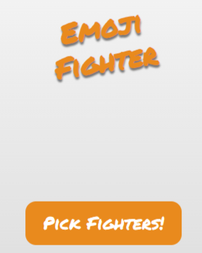
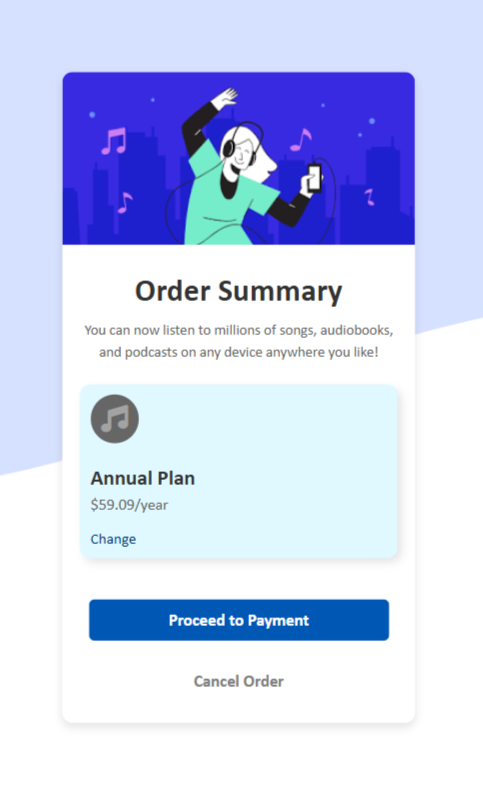

# Fun Web Projects Collection 🌐

This repository contains a collection of simple yet fun web-based projects built using HTML, CSS, and JavaScript. Each project is designed to demonstrate basic programming concepts and provide an engaging user experience.

---

## Table of Contents
- [Overview](#overview)
- [Projects](#projects)
  - [Emoji Fighter](#emoji-fighter)
  - [Blackjack Game](#blackjack-game)
  - [Order Summary](#order-summary)
  - [Reading Tracker](#reading-tracker)
- [Technologies Used](#technologies-used)
- [Setup Instructions](#setup-instructions)

---

## Overview
This collection includes various mini-projects, each showcasing different interactive features and user interface designs. The projects are beginner-friendly and perfect for learning and experimenting with web development.

---

## Projects

### 1. Emoji Fighter
**Description**: Emoji Fighter is a fun and simple game where two random emoji fighters are selected to compete. Click the "Pick Fighters!" button to generate a match and see who comes out victorious!

**Features**:
- Random selection of emoji fighters
- Unique outcomes displayed on each click
- Reset functionality to start fresh

**Screenshot**:



**How to Play**:
- Click **"Pick Fighters!"** to generate two random emoji fighters.
  
---

### 2. Blackjack Game
**Description**: A simplified version of the classic casino game Blackjack. The goal is to get a card sum as close to 21 as possible without exceeding it.

**Features**:
- Draw random cards and calculate the sum
- Intuitive UI with clear game messages
- Start a new game or draw more cards

**Screenshot**:


**How to Play**:
- Click **"Start Game"** to draw two initial cards.
- Draw more cards until you either hit Blackjack or go bust.

---

### 3. Order Summary
**Description**: A responsive web application that displays an order summary card with plan details, price, and options to proceed or cancel.

**Features**:
- Clean and modern UI
- Responsive design for various devices
- Action buttons and a change link for plan modification

**Screenshots**:
- **Laptop View**: 
- **Mobile View**: 

---

### 4. Reading Tracker
**Description**: A simple web app to track the number of pages read. Users can increment the page count, save their progress, and view previous entries.

**Features**:
- Track and save your reading progress
- Total count of pages read across all sessions
- Display previous entries

**Screenshot**:


**Usage**:
- Click **"ADD PAGE"** to increment the count.
- Click **"SAVE"** to update your total pages read and display your entries.

---

## Technologies Used
- **HTML5**: For structure and layout
- **CSS3**: For styling and responsive design
- **JavaScript**: For interactivity and game logic

---

## Setup Instructions
1. Clone this repository to your local machine:
   ```bash
   git clone https://github.com/yourusername/Fun-Web-Projects-Collection.git
   ```
2. Open the desired project folder and run `index.html` in your web browser.
3. Enjoy exploring each mini-project!
