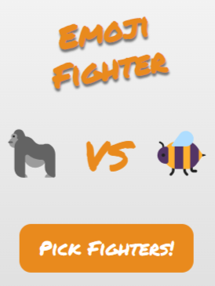
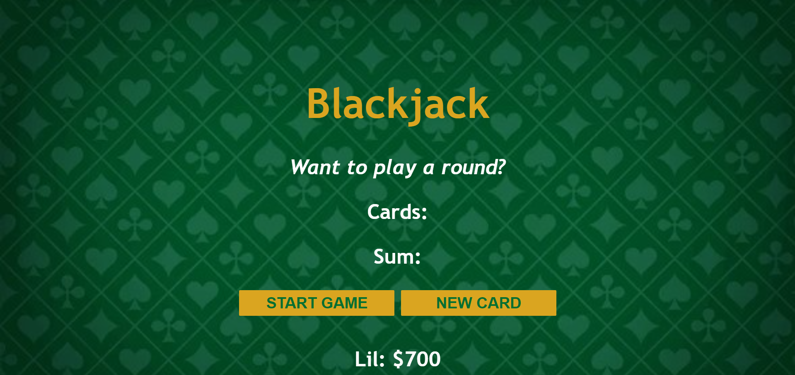
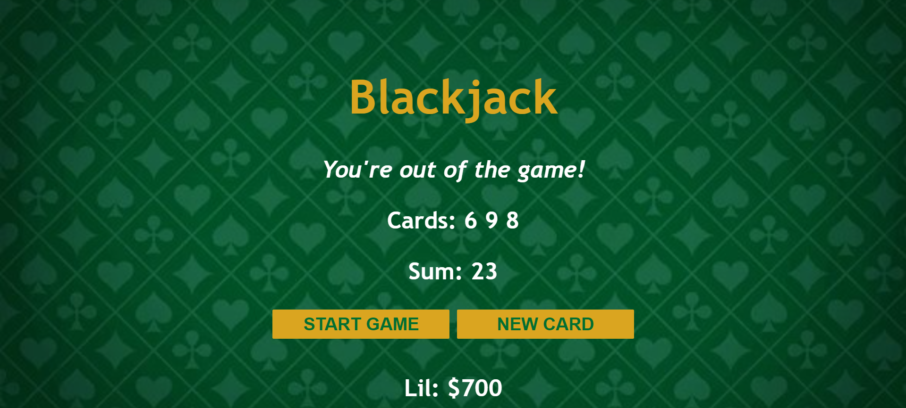
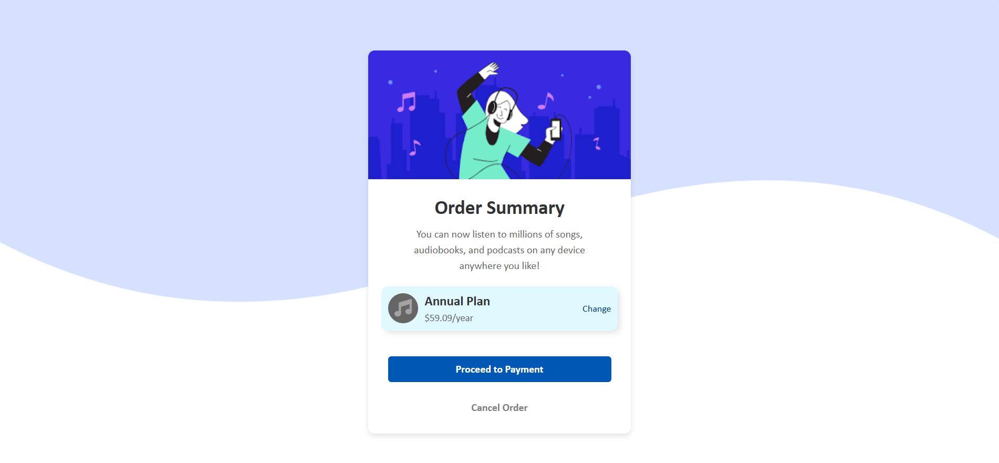
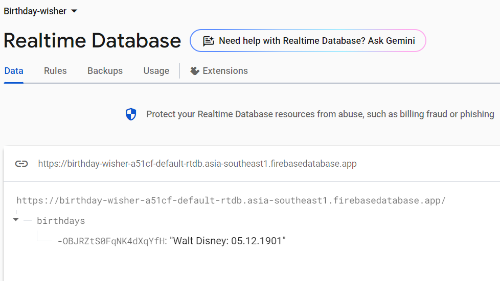
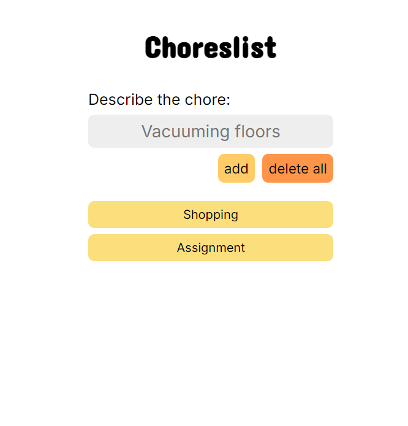

Here's the updated and complete `README.md` file with your requested format:

---

# Fun Web Projects Collection 🌐

This repository contains a collection of simple yet fun web-based projects built using HTML, CSS, and JavaScript. Each project is designed to demonstrate basic programming concepts and provide an engaging user experience.

---

## Table of Contents
- [Overview](#overview)
- [Projects](#projects)
  - [Emoji Fighter](#emoji-fighter)
  - [Blackjack Game](#blackjack-game)
  - [Order Summary](#order-summary)
  - [Reading Tracker](#reading-tracker)
  - [Birthday Date Collector](#birthday-date-collector)
  - [Chores List](#chores-list)
  - [Scoreboard App](#scoreboard-app)
- [Technologies Used](#technologies-used)
- [Contributing](#contributing)
- [License](#license)

---

## Overview
This collection includes various mini-projects, each showcasing different interactive features and user interface designs. The projects are beginner-friendly and perfect for learning and experimenting with web development.

---

## Projects

### 1. Emoji Fighter
**Description**: Emoji Fighter is a fun and simple game where two random emoji fighters are selected to compete. Click the "Pick Fighters!" button to generate a match and see who comes out victorious!

**Features**:
- Random selection of emoji fighters
- Unique outcomes displayed on each click
- Reset functionality to start fresh

**How to Play**:
- Click **"Pick Fighters!"** to generate two random emoji fighters.

---

### 2. Blackjack Game
**Description**: A simplified version of the classic casino game Blackjack. The goal is to get a card sum as close to 21 as possible without exceeding it.

**Features**:
- Draw random cards and calculate the sum
- Intuitive UI with clear game messages
- Start a new game or draw more cards

**How to Play**:
- Click **"Start Game"** to draw two initial cards.
- Draw more cards until you either hit Blackjack or go bust.

---

### 3. Order Summary
**Description**: A responsive web application that displays an order summary card with plan details, price, and options to proceed or cancel.

**Features**:
- Clean and modern UI
- Action buttons and a change link for plan modification

**Screenshots**:
- **Laptop View**:
  

---

### 4. Reading Tracker
**Description**: A simple web app to track the number of pages read. Users can increment the page count, save their progress, and view previous entries.

**Features**:
- Track and save your reading progress
- Total count of pages read across all sessions
- Display previous entries

**Usage**:
- Click **"ADD PAGE"** to increment the count.
- Click **"SAVE"** to update your total pages read and display your entries.

---

### 5. Birthday Date Collector
**Description**: This project allows users to input their birthdays and save them to Firebase Realtime Database. It provides a simple user interface where users can add their birthdays, and it stores the data in Firebase for retrieval and future use.

**Features**:
- Users can input their birthday and submit it using the "Submit" button.
- The birthday information is stored in Firebase Realtime Database.
- The input field is cleared after each submission.

**How to Use**:
1. Enter your birthday in the input field.
2. Click **"Submit"** to save your birthday to the Firebase Realtime Database.
3. The input field will be cleared after the birthday is submitted.
4. View the submitted birthdays in Firebase Console.

**Firebase Setup**:
1. Create a Firebase project in the [Firebase Console](https://console.firebase.google.com/).
2. Set up Firebase Realtime Database and get the URL for the `databaseURL` field in the `firebaseConfig` object.

---

### 6. Chores List
**Description**: A simple web app to manage chores, where users can add chores to a list and delete all items with a double-click.

**Features**:
- Add chores to the list.
- Delete all chores with a double-click on the "Delete All" button.
- Firebase integration for storing and retrieving chore data.

**How to Use**:
- Enter a chore description in the input field.
- Click **"Add"** to add the chore to the list.
- Double-click **"Delete All"** to remove all chores from the list.

---

### 7. Scoreboard App
**Description**: A simple scoreboard app to track scores for two teams (Home and Guest). Users can increase the score by different values and reset the scores.

**Features**:
- Track scores for Home and Guest teams
- Buttons to increase score by +1, +2, or +3 points
- Reset button to reset both scores to zero
- Responsive design with a clean UI

**How to Use**:
1. Click the **+1**, **+2**, or **+3** buttons to increase the score for the Home or Guest team.
2. Click the **Reset** button to set both scores to zero.

## Technologies Used
- **HTML5**: For structure and layout
- **CSS3**: For styling and responsive design
- **JavaScript**: For interactivity and game logic
- **Firebase Realtime Database**: For storing and retrieving user data

Sure! Here’s a more concise version of the README:

---

# Random Password Generator

## Overview
This project generates two random passwords of 12 characters each, using a mix of uppercase letters, lowercase letters, digits, and special characters. The generated passwords are displayed on the webpage in real-time when the user clicks the "Generate Passwords" button.

## Features
- Generate two random, secure passwords with a click.
- Passwords include uppercase, lowercase, digits, and special characters.

## Technologies
- **HTML**: Page structure.
- **CSS**: Styling for the page.
- **JavaScript**: Generates and displays passwords.

## How It Works
1. Clicking the "Generate Passwords" button triggers the `generatepass()` function.
2. The function generates two passwords, each 12 characters long.
3. The passwords are displayed in the webpage elements.

## Files Included
- `index.html`: Page structure.
- `index.css`: Styling.
- `index.js`: Password generation logic.

## Usage
1. Open `index.html` in a browser.
2. Click **"Generate Passwords"** to see the results.

## License
MIT License

---

This version gives a brief yet clear description of how the project works. Let me know if you need any further edits!
